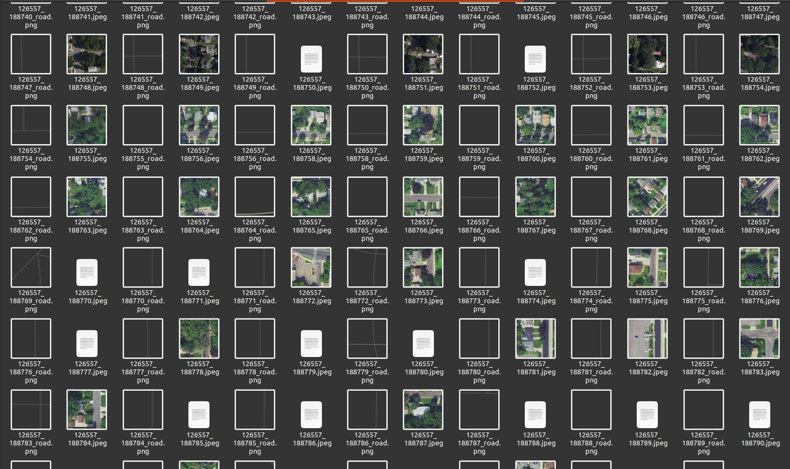
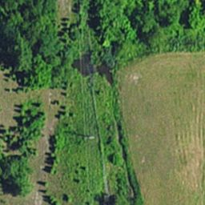
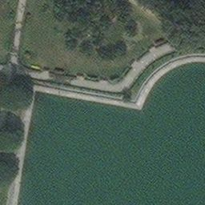
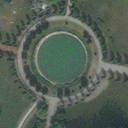
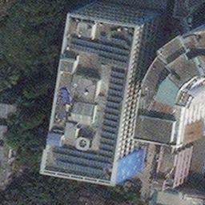
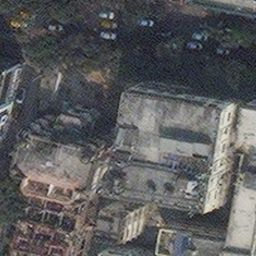
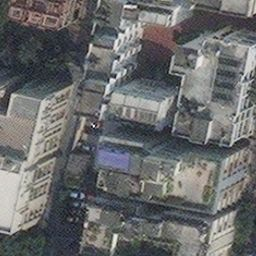
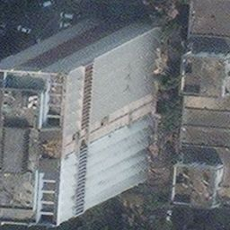
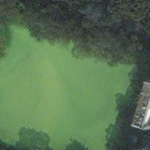
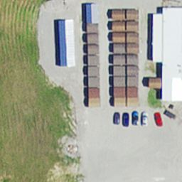

# jimutmap 
[](https://zenodo.org/badge/latestdoi/169246557)
[](https://pypi.org/project/jimutmap/)

[](https://www.gnu.org/licenses/gpl-3.0) 


#### Purpose 

This manually brute forces [apple-map](https://satellites.pro/#32.916485,62.578125,4). It Then scraps all the tiles as given by the 
parameters provided by the user.

#### YouTube video : 
If you are confused with the documentation, please see this video, to see the scraping in action [Apple Maps API to get enormous amount of satellite data for free using Python3](https://www.youtube.com/watch?v=voH0qhGXfsU).


#### Installation

```
sudo pip install jimutmap
```

#### Pypi
*   [jimutmap](https://pypi.org/project/jimutmap/)

#### Works in Colab too!

[colab-notebook](maps_scraper.ipynb)


#### Image

<center>
<a href="https://www.youtube.com/watch?v=wCbZhtWe72w" alt="yt video" target="_blank"></a>
</center>


Note :

The api acess-key (which can be found out by selecting one tile from Apple Map, through chrome/firefox by going Developer->Network and then it is this part of the link &accessKey...dark) is valid for a period of 10-15 mins. You need to manually go to [apple-map](https://satellites.pro/#32.916485,62.578125,4), get the API access key by pressing ctrl+shift+E and going to the network area. I tried to reverse engineer this thing
but couldn't. First part of the key is time in sec from 1970, but other part is some output of complex function which needs time
to decipher. If anyone finds it, let me know, I'll add you to the contributor's section and may make this API fully automatic.


#### Need for hacking and scraping satellite data

Well it's good (best in the world) satellite images, we just need to give the coordinates (Lat,Lon, and zoom) to get your dataset
of high resolution satellite images! Create your own dataset and apply ML algorithms :')

#### Some of the example images downloaded :

| | | |
|:-------------------------:|:-------------------------:|:-------------------------:|
|  |  ||
|  |  ||
|  |  ||


The scraping API is present, call it and download it.
```python
>>from jimutmap import api
>>a=api('&api-access-key',min_lat_deg,max_lat_deg,min_lon_deg,max_lon_deg,zoom=19,verbose=False,threads_=110)

# Change the access key here
# give the (min_lat,max_lat,min_lon,max_lon,access_key) in this function
# note the access key is manually changed all the time here!

>>a.download()

100%|██████████████████████████████████████████████████████████████                     | 1000/10000000 [00:02<00:00, 3913.19it/s

```

#### Perks 

Well I'm not that bad. This is done through parallel proccessing, so this will take all the thread in your CPU, change the 
code to your own requirements! This is done so that you could download about **40K** images in **30 mins!** (That's too fast!!!)

Do this :

```
$ mv *.jpeg satellite_data
```

Please move this data after every fetch request done! Else you won't get the updated information (tiles) of satellite data after
that tile. It is calculated automatically so that all the progress remains saved!

#### Note
This also uses multithreading, which may overload your computer, so set the parameters in the API, minimise the pool else your PC may hang! 


## [LICENSE](https://github.com/Jimut123/jimutmap/blob/master/LICENSE)
```
 GNU GENERAL PUBLIC LICENSE
                       Version 3, 29 June 2007

 Copyright (C) 2019-20 Jimut Bahan Pal, <https://jimut123.github.io/>
 Everyone is permitted to copy and distribute verbatim copies
 of this license document, but changing it is not allowed.
```


Author:
* [Jimut Bahan Pal](https://jimut123.github.io/)


